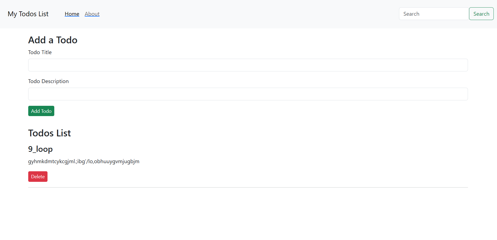

# MyToDoList

MyToDoList is a simple and intuitive web application that allows you to create, manage your tasks online. With features like add todo, delete todo .
## Features
- **Create, Edit, and Delete Tasks**: Add new tasks, modify existing ones, and remove them with ease.
- **Categorize Tasks**: Organize tasks by categories for improved productivity.

## Bonus Feature
- **Persistent Tasks**: Even if you refresh the page, your tasks will remain intact, ensuring uninterrupted productivity.
## Screenshot
Here's a glimpse of MyToDoList:

## Getting Started
To get started with MyToDoList, follow these simple steps:
1. **Clone the Repository**:
```bash
git clone https://todo-list-snowy-zeta.vercel.app/